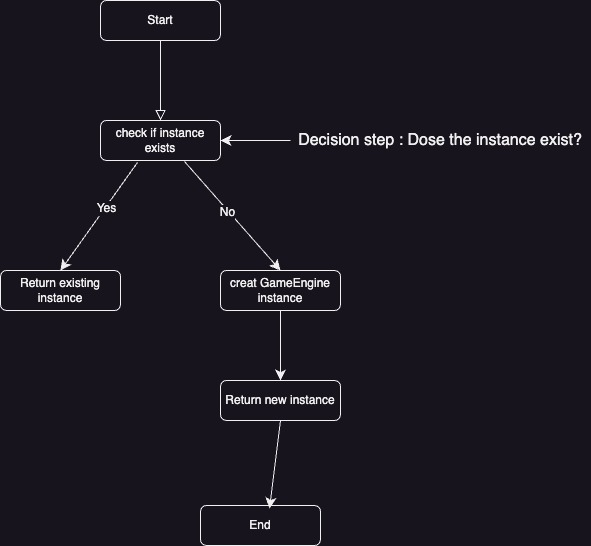

# Game Event System - Singleton Pattern

## Thought Process Behind the Singleton Pattern

The main thought process behind using the Singleton pattern is to ensure that only **one instance** of the `GameEngine` class is created during the game's runtime. This prevents the game from having multiple `GameEngine` instances, which could lead to inconsistent game states or other issues.

1. **Check if an instance exists**: When the system first requests the `GameEngine` instance, it checks if an instance already exists.
2. **Return existing instance**: If an instance exists, the system will return that instance to ensure consistency.
3. **Create a new instance**: If no instance exists, the system creates a new `GameEngine` instance and returns it.
4. **Ensure consistent access**: Every future request for the `GameEngine` will return the same instance.

---

**Design Pattern**: Singleton

# Design Pattern Structure

Here’s a visual representation of the Singleton pattern as implemented in the `GameEngine`:

The design pattern implemented is the **Singleton pattern**. The Singleton pattern ensures that a class has only one instance and provides a global point of access to that instance. In this project, the `GameEngine` class implements the Singleton pattern by using a private static attribute, `instance`, to store the single instance of the class. The public static method `getInstance()` controls the access to this instance. If no instance exists, the method creates one; otherwise, it returns the already existing instance. This pattern is particularly useful in scenarios where only one instance of a class is needed, such as managing the game engine in this case, to ensure consistency and avoid issues that could arise from having multiple instances.

---

# Benefits of Using the Singleton Pattern

The main benefits of using the Singleton pattern in the game system are:

1. **Controlled Access to the Single Instance**: The Singleton pattern ensures that only one instance of the `GameEngine` exists, preventing accidental duplication.
2. **Lazy Initialization**: The instance is only created when it's needed for the first time, saving memory and resources.
3. **Global Access**: The Singleton pattern provides a global access point to the `GameEngine` instance, ensuring that different parts of the game interact with the same instance.
4. **Consistency Across the Game**: Using a single instance ensures the game state remains consistent, preventing errors that could arise from having multiple instances with different states.

---

# Consequences

1. **Global State and Tight Coupling**: Singleton can introduce tight coupling between different parts of the code that depend on the Singleton instance. This can make refactoring and maintaining the system more challenging.
2. **Difficulties in Testing**: Since the Singleton pattern relies on a single instance, it can complicate unit testing, especially when multiple tests run in parallel. Shared state across tests can lead to unpredictable behavior.
3. **Concurrency Issues**: In multi-threaded environments, additional synchronization mechanisms may be required to ensure that only one instance of the Singleton is created safely, which can add complexity.
