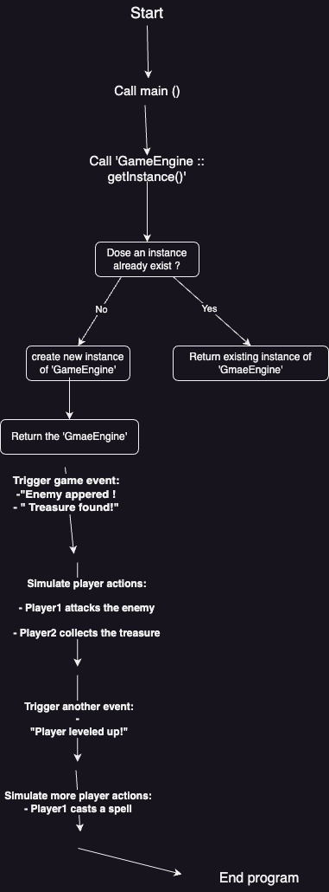
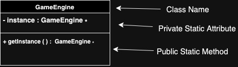

# Game Event System - Singleton Pattern

## Thought Process Behind Game event system

This program uses the Singleton Design Pattern to ensure only one instance of the GameEngine is created. In the main function, getInstance either returns an existing instance or creates a new one. The game engine then handles events like "Enemy appeared!" and player actions like attacking enemies, all processed by the single game engine instance. The program ends after processing all events and actions, ensuring consistent control throughout.

**Design Pattern**: Singleton

# Design Pattern Structure

Here’s a visual representation of the Singleton pattern as implemented in the `GameEngine`:

In this project, the Singleton pattern ensures that only one instance of the GameEngine class exists, providing a shared access point for the entire system. The pattern works by using a private static variable, instance, to store the sole instance of the class. The static method getInstance() controls the creation and retrieval of this instance, generating it when necessary or returning the existing one. This approach is ideal for scenarios where centralized control is essential, like managing a game engine, to ensure consistency and prevent the complications that could arise from multiple instances.

---

## Benefits of Using the Singleton Pattern

**Unified Control Point**: The Singleton pattern guarantees a solitary GameEngine instance, eliminating the risk of inadvertently spawning multiple copies.
**Resource Conservation**: By postponing instance creation until it's explicitly required, the Singleton pattern helps preserve system resources and memory allocation.
**Universal Access**: The game engine can be reached from any part of the codebase, facilitating straightforward usage of the same instance without the need to transfer references between components.
**State Uniformity**: Employing a single instance across the entire game ensures coherent management of game states, reducing the likelihood of errors arising from conflicting instances
---

# Consequences

**Widespread Dependence**: Overreliance on a Singleton can result in a closely intertwined system, where numerous code segments are tied to the same instance, complicating future modifications or restructuring efforts.
**Hurdles in Testing**: The presence of a lone instance can impede the process of writing unit tests, particularly when tests are executed concurrently, as shared states may lead to conflicts.
**Multithreading Complexities**: In environments with multiple threads, ensuring the creation of only one instance may necessitate additional synchronization techniques, introducing extra layers of code complexity.
